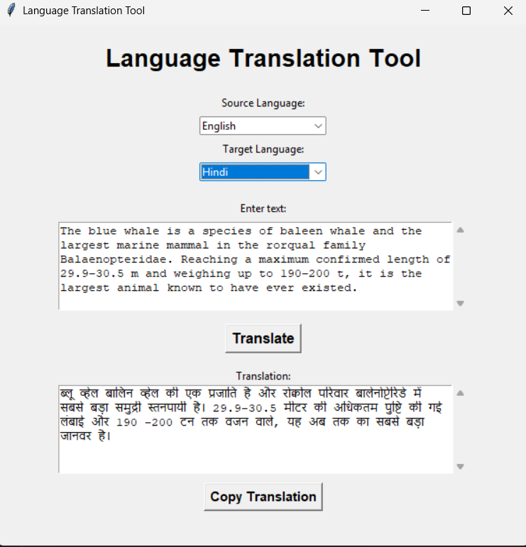
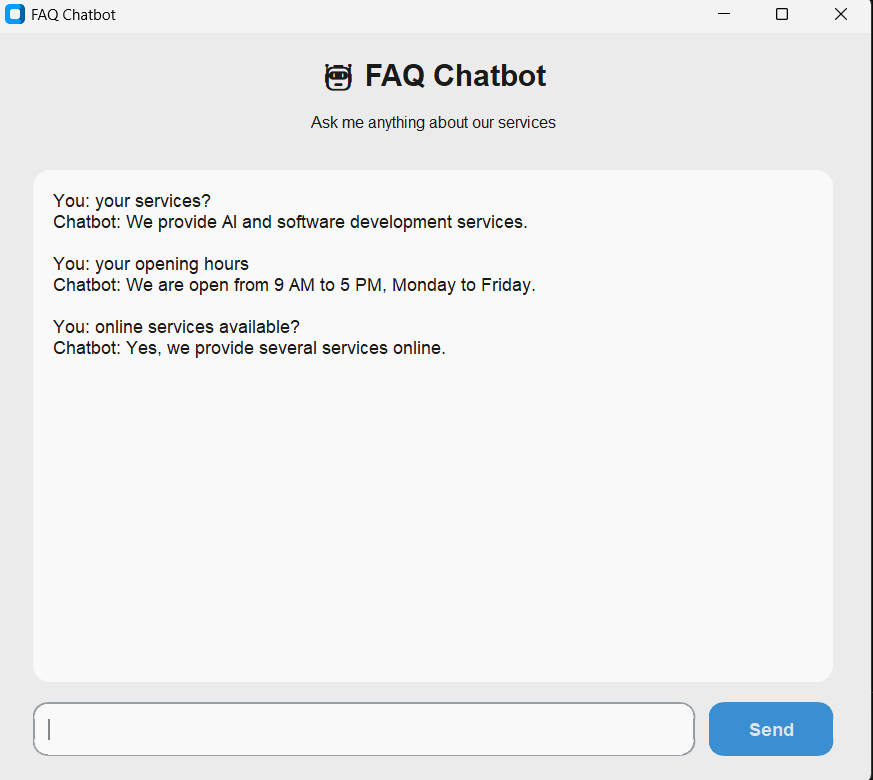

This repository contains two AI projects developed as part of my Artificial Intelligence tasks.

## Task 1: Language Translation Tool

### Description
The Language Translation Tool is a simple Python-based application that translates text between different languages using a free translation API.

### Supported Languages
- English
- Urdu
- Arabic
- French
- Spanish
- Hindi

### Features
- Translation between supported languages
- Multiple sentence translation while maintaining sentence order
- Language detection
- Warning when the selected source language does not match the entered text
- Read-only translation output
- Scrollable input and output boxes
- Word wrapping for better text display
- Copy Translation button
- Message when the input box is empty
- Output automatically clears when the input is cleared

### Technologies Used
- Python
- Tkinter
- MyMemory Translation API
- Requests
- Langdetect

### How It Works
1. The user selects a source language.
2. The user selects a target language.
3. The user enters the text to be translated.
4. The program detects the language of the entered text.
5. If the detected language does not match the selected source language with sufficient confidence, a warning is displayed.
6. If the language is correct, the text is divided into sentences.
7. Each sentence is sent to the translation API.
8. The translated sentences are combined in the original order.
9. The translation is displayed in the output box.
10. The user can copy the translation using the Copy Translation button.

### File
Task1_translator.py

## Task 2: FAQ Chatbot

### Description
The FAQ Chatbot is a Python-based chatbot that answers frequently asked questions using Natural Language Processing and machine learning techniques.

### Features
- Simple graphical user interface
- Answers frequently asked questions
- Uses alternative question phrasings
- Uses TF-IDF for text representation
- Uses cosine similarity to find the most relevant answer
- Includes a similarity threshold to avoid giving unrelated answers
- Enter key can be used to send questions
- Scrollable chat area

### Technologies Used
- Python
- Tkinter / CustomTkinter
- NLTK
- Scikit-learn
- TF-IDF
- Cosine Similarity

### How It Works
1. The user enters a question.
2. The chatbot converts the question into a numerical representation using TF-IDF.
3. The chatbot compares the user's question with the stored FAQ questions.
4. Cosine similarity is used to determine which FAQ is most similar.
5. If the similarity is high enough, the corresponding answer is displayed.
6. If no suitable match is found, the chatbot indicates that it does not have a suitable answer.

### File
Task2_chatbotf.py

## Screenshots

### Task 1: Language Translation Tool

### Task 2: FAQ Chatbot

